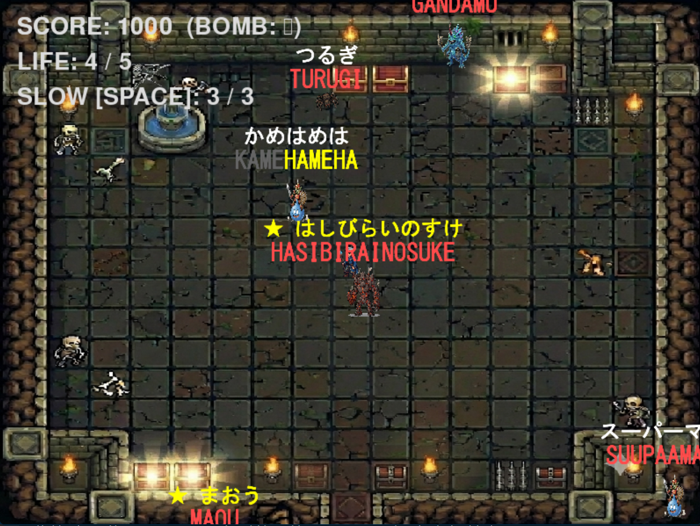

# タイピングヒーロー 

主人公キャラクターをタイピング操作で操り、迫り来る敵を倒していくタイピングアクションゲームです。

---

## 🎮 ゲームの概要
迫り来る敵の頭上に表示されるワードを素早くタイピングして、敵を撃退（攻撃）します。
敵が主人公に接触するとゲームオーバーとなります。

### ゲーム画面

---

## ⚙️ 動作環境
* **Python**: `>= 3.10`
* **Pygame**: `>= 2.1`

---

## 🛠️ 基本機能 & メンバー別追加機能

本ゲームは以下の共通基本機能に加え、各メンバーによるユニークな追加機能で構成されています。

### 🏠 共通基本機能
* **背景・キャラクター描画**: ゲーム背景および主人公の描画。
* **タイピング判定システム**: 画面上の文字入力に応じた基本攻撃システム。

### 🚀 メンバー別追加機能
| 担当者 | 機能名 | 機能概要 |
| :--- | :--- | :--- |
| **小澤** | 敵のスピードダウン | 使用回数制限あり。shiftを押すことでピンチの時に敵全体の移動速度を低下させる。 |
| **小出** | ボーナス敵の追加 | 倒すと獲得ポイントが2倍になる特殊な敵が出現。 |
| **高本** | アルティメットモード | Enterキーをクリックすると、1000 SCOREを失う代わりに画面上の敵を消滅させる。 |
| **金子** | サウンドシステム | ライフがなくなり、ゲームを終了する際にgameoverという効果音の追加。 |
| **菊池** | ゾンビタイム | 同一の敵に対して5回タイピングミスをすると、その敵が「ゾンビ状態」に変貌。倒せなくなり、スタート地点から何度も蘇るお邪魔要素。 |
| **北條** | 敵のスピードを変更 | 時間経過で敵のスピードを変更します。 |

---

